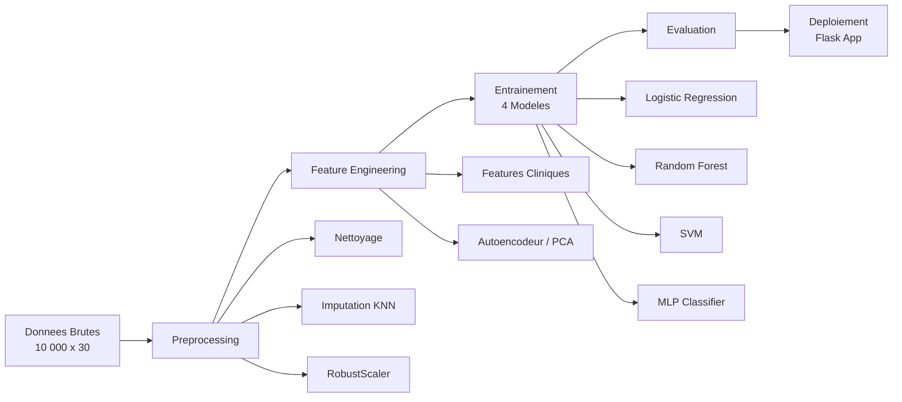

# Prediction du Risque de Maladie Cardiaque par Machine Learning

---

````carousel
## Slide 1 -- Page de Titre

# Prediction du Risque de Maladie Cardiaque

**Pipeline ML de bout en bout avec application web**

- **Technologies** : Python 3.12, scikit-learn, TensorFlow/Keras, Flask
- **Dataset** : 10 000 patients, 29 features cliniques
- **Objectif** : Classifier les patients a risque cardiaque (binaire : 0/1)

---

*Projet ML -- Classification Supervisee*
<!-- slide -->
## Slide 2 -- Contexte et Problematique

### Pourquoi ce projet ?

Les maladies cardiovasculaires sont la **premiere cause de mortalite mondiale** (OMS).

### Objectif

Developper un systeme de **prediction automatique** du risque de maladie cardiaque a partir de donnees cliniques du patient, en utilisant des techniques de Machine Learning.

### Approche

1. Pipeline ML complet (preprocessing -> feature engineering -> entrainement -> evaluation)
2. Comparaison de **5 modeles** de classification
3. Deploiement via une **application web Flask** pour des predictions en temps reel
<!-- slide -->
## Slide 3 -- Description du Dataset

### Heart Disease Synthetic Dataset -- 10 000 patients

| Categorie | Features |
|---|---|
| **Demographiques** | age, gender, height_cm, weight_kg, bmi |
| **Signes vitaux** | systolic_bp, diastolic_bp, resting_heart_rate, oxygen_saturation |
| **Bilan sanguin** | glucose, insulin, total_cholesterol, hdl, ldl, triglycerides, hemoglobin |
| **Mode de vie** | smoking_status, smoking_years, alcohol_consumption, physical_activity_level, sleep_hours, stress_level, diet_quality |
| **Antecedents** | diabetes, hypertension, family_history_heart_disease |
| **Scores de risque** | cardiac_risk_score, metabolic_syndrome_score |
| **Cible** | heart_disease (0 = Non, 1 = Oui) |

- **Valeurs manquantes** : 2 007 (imputees par KNN)
- **Distribution cible** : 51.7% sains / 48.3% malades (equilibre)
<!-- slide -->
## Slide 4 -- Architecture du Pipeline


<!-- slide -->
## Slide 5 -- Etape 1 : Preprocessing

### Operations realisees

| Etape | Methode | Detail |
|---|---|---|
| Suppression ID | `drop_id_column` | Colonne `patient_id` non predictive |
| Doublons | `drop_duplicates` | 0 doublon detecte |
| Outliers | IQR x 3.0 | 1 502 valeurs ajustees |
| Valeurs manquantes | KNN Imputer (k=5) | 2 007 -> 0 valeurs manquantes |
| Encodage | LabelEncoder | Colonnes categoriques (aucune dans ce dataset) |
| Scaling | **RobustScaler** | Robuste aux outliers (mediane + IQR) |
| Split | 80/20 stratifie | 8 000 train / 2 000 test |
<!-- slide -->
## Slide 6 -- Etape 2 : Feature Engineering

### 20 nouvelles features cliniques creees

| Groupe | Features ajoutees |
|---|---|
| **Pression arterielle** | pulse_pressure, mean_arterial_pressure, bp_category, systolic_bp_sq |
| **Profil lipidique** | cholesterol_ratio, ldl_hdl_ratio, non_hdl_cholesterol, triglyceride_hdl_ratio, cholesterol_ratio_sq |
| **IMC** | bmi_category, bmi_sq |
| **Age** | age_decade, age_squared, age_bmi_interaction |
| **Metabolique** | glucose_insulin_ratio, insulin_resistance_idx |
| **Risque composite** | cardiovascular_index, lifestyle_score |
| **Comorbidites** | smoking_age_interaction, comorbidity_count |

### Autoencodeur (Fallback PCA)
- Architecture : Input -> 128 -> 64 -> 32 -> **16** -> 32 -> 64 -> 128 -> Input
- Fallback PCA (16 composantes) si TensorFlow absent
- **Total final : 64 features** (28 originales + 20 ingenierees + 16 latentes)
<!-- slide -->
## Slide 7 -- Etape 3 : Modeles Entraines

### 4 classifieurs compares (+ XGBoost si installe)

| Modele | Description | Hyperparametres |
|---|---|---|
| **Logistic Regression** | Modele lineaire de reference | max_iter=1000, L2 |
| **Random Forest** | Ensemble de 200 arbres | n_estimators=200, balanced |
| **SVM** | Noyau RBF avec calibration | probability=True |
| **MLP Classifier** | Reseau de neurones 3 couches | max_iter=500 |

### Selection du meilleur modele
- Validation croisee stratifiee a **5 folds**
- Metrique de selection : **ROC-AUC**
- Meilleur modele sauvegarde automatiquement dans `models/best_model.pkl`
<!-- slide -->
## Slide 8 -- Resultats : Comparaison des Modeles

| Modele | Accuracy | Precision | Recall | F1-Score | ROC-AUC | Temps (s) |
|---|---|---|---|---|---|---|
| **Random Forest** | **0.7155** | **0.7083** | **0.6988** | **0.7035** | **0.7980** | 8.82 |
| MLP Classifier | 0.4835 | 0.4832 | 1.0000 | 0.6516 | 0.5005 | 0.41 |
| Logistic Regression | 0.5180 | 1.0000 | 0.0021 | 0.0041 | 0.4987 | 0.05 |
| SVM | 0.5180 | 1.0000 | 0.0021 | 0.0041 | 0.4973 | 13.84 |

> [!IMPORTANT]
> **Random Forest** est le meilleur modele avec un ROC-AUC de **0.80** et un F1-Score de **0.70**.
<!-- slide -->
## Slide 9 -- Visualisations : Courbes ROC


<!-- slide -->
## Slide 10 -- Visualisations : Matrices de Confusion


<!-- slide -->
## Slide 11 -- Visualisations : Importance des Features


<!-- slide -->
## Slide 12 -- Visualisations : Comparaison des Metriques


<!-- slide -->
## Slide 13 -- Application Web Flask

### Interface de prediction en temps reel

- **Formulaire interactif** avec toutes les features du patient
- **Prediction instantanee** avec probabilite et niveau de risque
- **Calcul automatique du BMI** a partir de la taille et du poids
- **API REST** disponible a `/api/predict` pour un usage programmatique
- **Health check** a `/health`

### Niveaux de risque

| Probabilite | Niveau |
|---|---|
| < 30% | Faible |
| 30% - 50% | Modere |
| 50% - 70% | Eleve |
| > 70% | Tres eleve |

### Lancement
```bash
python app/app.py
# Ouvrir : http://localhost:5000
```
<!-- slide -->
## Slide 14 -- Structure du Projet

```
projet_ml_retail/
|-- data/
|   |-- raw/                    # Dataset original (CSV)
|   |-- processed/              # Donnees nettoyees
|   |-- train_test/             # Splits train/test
|-- src/
|   |-- utils.py                # Configuration, logging, I/O
|   |-- preprocessing.py        # Nettoyage, imputation, scaling
|   |-- feature_engineering.py  # Features cliniques + Autoencodeur
|   |-- train_model.py          # Entrainement et selection
|   |-- evaluate_model.py       # Metriques et visualisations
|   |-- predict.py              # Pipeline d'inference
|   |-- run_pipeline.py         # Execution bout-en-bout
|-- models/                     # Modeles et artefacts sauvegardes
|-- app/app.py                  # Application web Flask
|-- reports/                    # Rapports et figures
|-- requirements.txt
```
<!-- slide -->
## Slide 15 -- Conclusion et Perspectives

### Resultats cles
- Pipeline ML complet et modulaire, de la donnee brute au deploiement web
- **Random Forest** selectionne comme meilleur modele (AUC = 0.80)
- Feature engineering avance avec 20 features cliniques + representation latente PCA/AE
- Application Flask fonctionnelle pour des predictions en temps reel

### Ameliorations possibles
- Installer **XGBoost** et **TensorFlow** pour exploiter le gradient boosting et le vrai autoencodeur
- **Optimisation des hyperparametres** (GridSearch / Optuna)
- Ajouter un **SMOTE** pour un eventuel desequilibre de classes
- Deploiement en production avec **Docker** et **CI/CD**
- Ajouter l'**interpretabilite** avec SHAP / LIME

### Technologies utilisees

| Composant | Technologie |
|---|---|
| Langage | Python 3.12 |
| ML | scikit-learn |
| Deep Learning | TensorFlow/Keras (fallback PCA) |
| Web | Flask |
| Visualisation | Matplotlib, Seaborn |
| Serialisation | Joblib |
````
